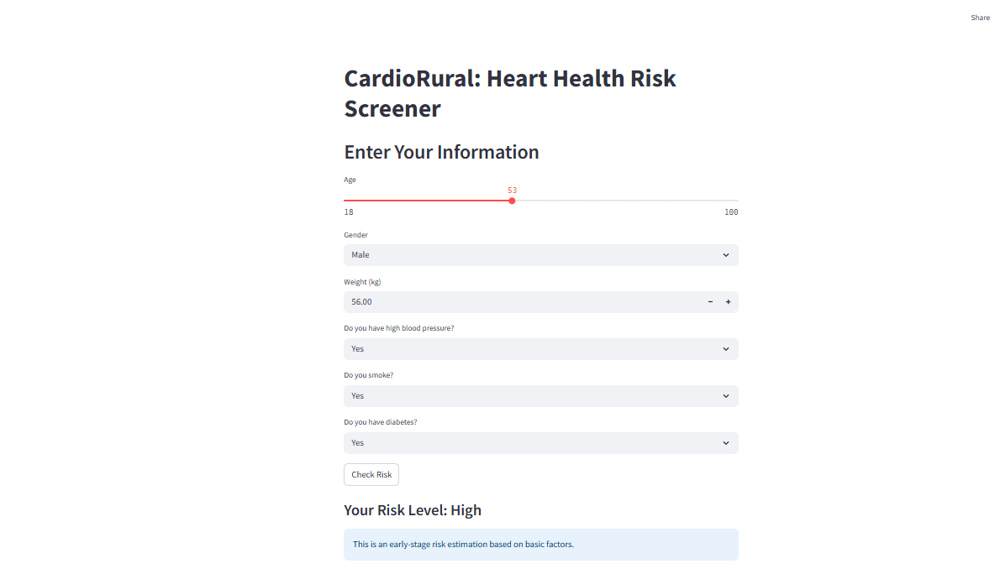

# CardioRural

**Preventing cardiovascular disease in rural African communities using data-driven mobile screening tools.**

CardioRural is a lightweight, open-source cardiovascular risk assessment tool built with [Streamlit](https://streamlit.io/). It is designed to bring preventive heart health screening to underserved rural populations through mobile and offline-friendly technology.

---

## 🚀 Try it Live

👉 [Launch CardioRural App](https://cardiorural-app-7vwrrh.streamlit.app/)

---

## 💡 Why This Matters

Cardiovascular disease (CVD) is a leading cause of death in Nigeria—and rural communities are hit the hardest due to lack of access to early detection tools. CardioRural helps bridge this gap by:

- Using simple clinical questions to estimate risk
- Offering personalized lifestyle guidance
- Making CVD screening accessible on mobile devices

---

## 🔧 Features

- Simple UI for mobile-friendly use
- Collects basic inputs: age, sex, weight, blood pressure, smoking, and diabetes status
- Outputs: Low, Moderate, or High CVD risk category
- Personalized message based on risk level

---

## 🧪 How It Works

This version uses a **rule-based risk scoring logic** based on early-stage public health screening principles (inspired by Framingham and WHO tools). In future versions, we will:

- Train a logistic regression or decision tree model with real-world data
- Improve predictive accuracy
- Tailor for African populations

---

## 📦 Tech Stack

- Python
- Streamlit
- Pandas
- Scikit-learn *(coming soon)*

---

## 🗺️ Roadmap

- ✅ MVP live app completed
- 🔲 Local language support (Yoruba, Hausa, Igbo)
- 🔲 SMS-based access
- 🔲 AI-driven predictions
- 🔲 NGO collaboration for pilot testing

---

## 📜 License

This project is licensed under the **MIT License** – feel free to use, fork, and build on it.

---

## 👤 Author

**Afolabi Mahmood Olalekan**  
Medical student • Data Scientist • Digital health advocate  
🌍 Nigeria  
🔗 [LinkedIn](https://www.linkedin.com/in/your-link-here) | 🔗 [GitHub](https://github.com/AFB-M)

---

> **This is an early-stage risk estimation tool. Not a substitute for medical advice. Always consult a healthcare professional.**

